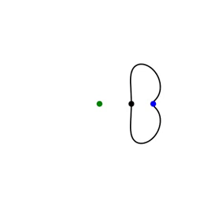
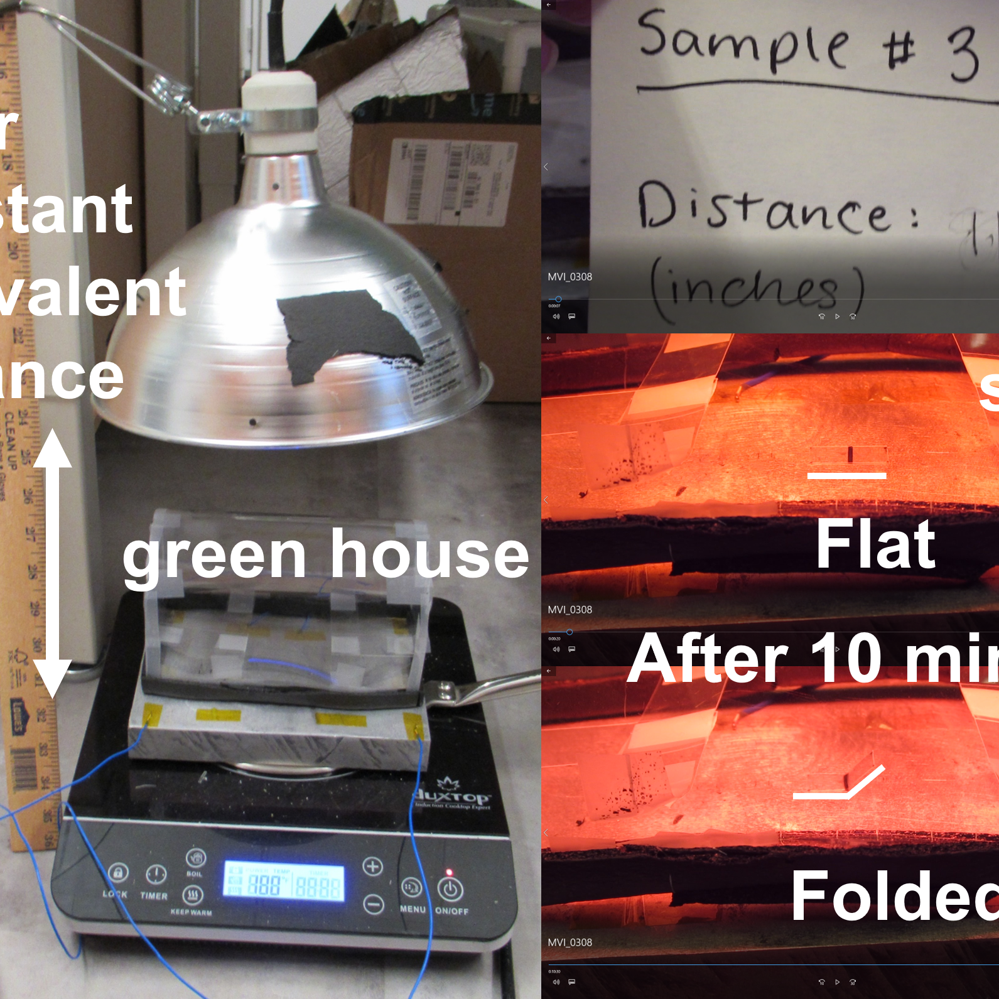
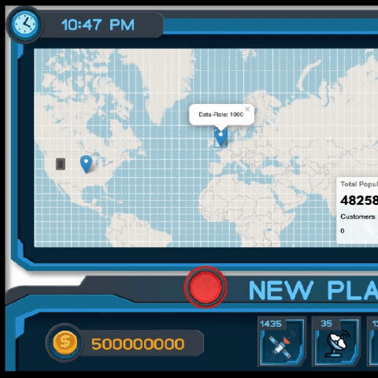
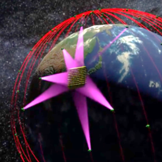

| [About](./index.html)      | [People](./people-page.html)         | [Research](./research-page.html) | [Publications](./publications_page.html)|

<html>
<head>
<meta name="viewport" content="width=device-width, initial-scale=1">

<!-- Add icon library -->
<link rel="stylesheet" href="https://cdnjs.cloudflare.com/ajax/libs/font-awesome/4.7.0/css/font-awesome.min.css">
  

</head>
<body>

<h2>Legend</h2>

<button class="btn"><i class="fa fa-television"></i> Poster</button>
<button class="btn"><i class="fa fa-file-pdf-o"></i> Article</button>
<button class="btn"><i class="fa fa-youtube-play"></i> Video</button>
<button class="btn"><i class="fa fa-mortar-board"></i> Edu Content</button>

 
   <button class="btn"><i class="fa fa-gamepad"></i> Interactive Content</button>

  <!--  
  

  

    

      
    

    

      
    

     

        <h2>Project Title</h2>
        
Collaborators

        
Description of the project

       
       
Icon buttons with text:

<button class="btn" onclick="window.location.href='https://w3docs.com';"><i class="fa fa-television"></i></button>
<a href="./assets/projects/multibody/artwork007.png" download> <button class="btn"><i class="fa fa-file-pdf-o"></i> 2021 </button> </a>
<button class="btn"><i class="fa fa-youtube-play"></i></button>
<button class="btn"><i class="fa fa-mortar-board"></i> Close</button>
  <button class="btn"><i class="fa fa-gamepad"></i> </button>

       
      

  

 
//-->
   

  

    

    

      
    

    

      
    

    

     

        <h2>6DOF Motion within Multi-Body Gravitational Fields</h2>    
       

<a href="https://engineering.purdue.edu/people/kathleen.howell.1/Publications/Conferences/2017_AAS_GuzZimHowDav.pdf" download> <button class="btn"><i class="fa fa-file-pdf-o"></i> 2017 </button> </a>
       <a href="https://link.springer.com/article/10.1007/s42064-017-0012-7"> <button class="btn"><i class="fa fa-file-pdf-o"></i> 2018 </button> </a>
       <a href="./assets/projects/multibody/guzzetti2019.pdf" download> <button class="btn"><i class="fa fa-file-pdf-o"></i> 2019 </button> </a> 

            

<a href="https://auburncatalog.instructure.com/enroll/GYJ6JC" > <button class="btn"><i class="fa fa-mortar-board"></i> Intro to Multi-Body Dynamics</button> </a>
<a href="https://respected-deeply-allspice.glitch.me/" > <button class="btn"><i class="fa fa-gamepad"></i> Halo Orbit VR </button> </a>

       
      

  

 
 

        

 

  

    

    

      
    

    

      
    

    

     

       
        <h2>Flat Fabrication of Self-Assembling Space Systems</h2>
        
Collaborators: Russell Mailen

      

  

  

      
  

  

    

    

      
    

    

      
    

    

     

        <h2>Resilience of Proliferated LEO Constellations</h2>
        
Collaborators: Daniel Tauritz

      

  

  

       
</body>
</html>
